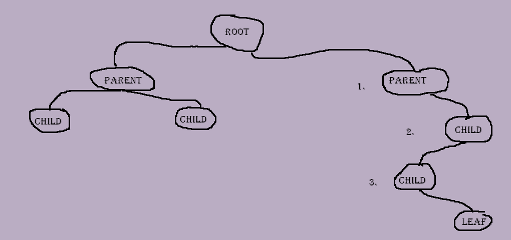

### 1. [Welcome](https://github.com/moscarelloscott/moscarelloscott/blob/main/CSE212.md) 2. [stack](https://github.com/moscarelloscott/moscarelloscott/blob/main/stack.md) 3. [linked list](https://github.com/moscarelloscott/moscarelloscott/blob/main/linkedlist.md)
# 4. [Binary Tree]

    Unlike the stack and Linked List, Binary Trees are Non-Linear, 
    they still use Nodes like the Linked List but do not have a head or tail, 
    instead the tree will have a single root at the top and children or leaves 
    at the bottom of the tree.
    
   
   
    In the example above #1 is a parent of #2 and # 2 is the child of #1, however # 2 is also the parent of #3
________________________________________________________________

    Just like the Linked List we must make a CLASS NODE for the Binary tree along with a CONSTRUCTOR function.
    Notice in the Constructor we assign a left and right node to store data of none for now.
    
~~~Python
    #Binary Tree
    #Start by creating a Class Node
 class Node:
     #Constructor
     def __init__(self, data):
            self.left = None
            self.right = None
            self.data = data
~~~
    Simple function to only fill the root of the tree by inputting 
    root = Node(10) and then call the function root.PrintTree1()
~~~Python
     def PrintTree1(self):
            print(self.data)   
~~~
    Here we are making a traversing tree placing the data into a column 
    with the smallest ontop and largest on the bottom
~~~Python
    #traversing Tree
     def insert(self, data):
        if self.data:
            if data < self.data:
                if self.left is None:
                    self.left = Node(data)
                else:
                    self.left.insert(data)
            elif data > self.data:
                if self.right is None:
                    self.right = Node(data)
                else:
                    self.right.insert(data)
            else:
                self.data = data
~~~
    The Inorder tree also runs from smallest to largest 
    but in a row instead of a column
~~~Python
                
        #Inorder TREE
        def PrintTree(self):
            if self.left:
            self.left.PrintTree()
        print(self.data)
        if self.right:
            self.right.PrintTree()
        def InOrder(self, root):
            res = []
            if root:
                res = self.InOrder(root.left)
                res.append(root.data)
                res = res + self.InOrder(root.right)       
            return res   
~~~

~~~Python
   print("\n___________input and output code_______________\n")   
   root = Node(10)
   root.PrintTree1()
   print("\nTraversing")
   root = Node(20)
   root.insert(16)
   root.insert(24)
   root.insert(3)
   root.PrintTree()
   print("\nInOrder")
   root = Node(20)
   root.insert(16)
   root.insert(24)
   root.insert(3)
   print(root.InOrder(root))
   print("\n____________Ending of code__________________")
 ~~~
    *Binary Tree Problem to solve

[VIDEO](https://moscarelloscott.github.io/project/index.html)
