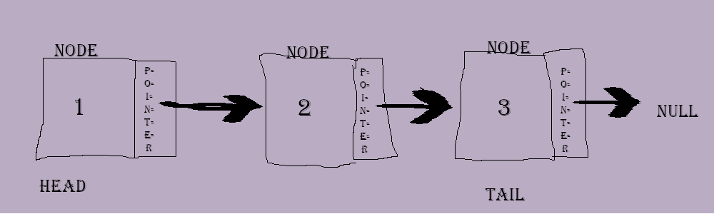
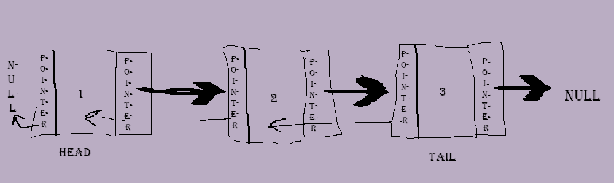

<!--- 👋 Hi, I’m @moscarelloscott
- 👀 I’m interested in ...
- 🌱 I’m currently learning ...
- 💞️ I’m looking to collaborate on ...
- 📫 How to reach me ...

moscarelloscott/moscarelloscott is a ✨ special ✨ repository because its `README.md` (this file) appears on your GitHub profile.
You can click the Preview link to take a look at your changes.
--->
# Python CSE212 Final Project - Linked List

### 1. [Welcome](https://github.com/moscarelloscott/moscarelloscott/blob/main/CSE212.md) 2. [stack](https://github.com/moscarelloscott/moscarelloscott/blob/main/stack.md)  4. [Binary Tree](https://github.com/moscarelloscott/moscarelloscott/blob/main/binarytree.md)
    
## 3. [linked list](https://github.com/moscarelloscott/moscarelloscott/blob/main/linkedlist.md)
    *linked list Introduction
         Linked list are a linear structure that forms a chain, unlike the stack method 
         any linked list node can be accessed without the need to pop or remove the last node inputted
         this makes the linked list faster than stack and pehaps better for larger more complexed databases.
         You should use linked list when you plan to add or remove data in the future as it is easier to
         add or remove nodes from any position in the array.
         
         Each node will have two seperate values, the value which hold the array object 
         and the second part is the pointer which points to the next node within the linked list.
         When the pointer has no nodes left to point at it will return a null.
         Here is an image of a singly linked list which can only travel in one direction:
  
  
         Doubly Linked List can travel in both directions having a pointer on both sides of the arrray object.
         each nod will have the data field and not one but two pointers called next and prev, next will continue
         moving forward in the same direction as the singly Linked List where prev will move in the oppistie 
         direction back towards the head. In either direction when we reach an empty space we get null.
   
  
 Efficiency of Linked list Operations
---------------------------------------------------------------------------
   
   Operation                        | Singly Linked List | Doubly Linked List
----------------------------------- | ------------------ | -----------------
Access an element                   | O(n)               | value 31
Add/remove at an interator position | O(1)               | value 32
Add/remove first element            | O(1)               | value 33
Add last element                    | O(1)               | value 33
Remove last element                 | O(n)               | value 33
  
    *linked list Example code
    
~~~Python
    print("The first step in creating a Linked List is to create a Node Class 
          \nHere we named the Node Class LinkedListNode")
    print("We use the constructor function init and must include the word self in the parenthesis 
           \nwe also automatically assigned the next node to none within this construtor function\n")
    print("class LinkedListNode: \n  def __init__(self, value, nextNode=None): \n  self.value = value 
          \n  self.nextNode = nextNode \n")

    class LinkedListNode:
       def __init__(self, value, nextNode=None):
          self.value = value
          self.nextNode = nextNode

    print ("Now we need to fill the empty nodes 
           \nwe create node variables here to push the numbers 1 to 3 into 3 different nodes 
           \n \n node1 = LinkedListNode(\"1\") \n node2 = LinkedListNode(\"2\") 
           \n node3 = LinkedListNode(\"3\") \n")       
    node1 = LinkedListNode("1")
    node2 = LinkedListNode("2")
    node3 = LinkedListNode("3")

    print("Now we assign each node to point to the next node \n  
          \n node1.nextNode = node2 \n node2.nextNode = node3 \n")

    node1.nextNode = node2
    node2.nextNode = node3

    print("Assign the current node to be node 1 \n \n currentNode = node1\n")
    currentNode = node1

    print("Finally we run a while loop to print out all the nodes with data inside them
           \nand the word NULL when we reach the empty node after the tail \n")
    print(" \n while True: \n   print (currentNode.value, \"->\") \n   if currentNode.nextNode is None:
            \n      print (\"NULL\") \n      break \n  currentNode = currentNode.nextNode \n")
    print("If you run this code the output will appear after this text\n")

    while True:
       print (currentNode.value, "->")
       if currentNode.nextNode is None:
          print ("NULL")
          break
       currentNode = currentNode.nextNode
    
    print("--end--")
~~~
    *linked list Problem to solve

<!---[VIDEO](https://moscarelloscott.github.io/project/index.html)--->
