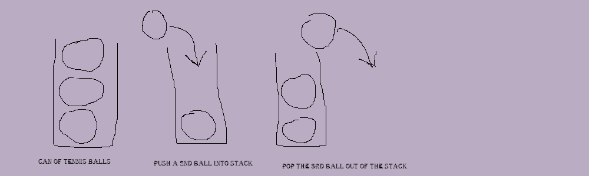

<!---
moscarelloscott/moscarelloscott is a ✨ special ✨ repository because its `README.md` (this file) appears on your GitHub profile.
You can click the Preview link to take a look at your changes.
--->
 
### 1. [Welcome](https://github.com/moscarelloscott/moscarelloscott/blob/main/CSE212.md)  3. [linked list](https://github.com/moscarelloscott/moscarelloscott/blob/main/linkedlist.md) 4. [Binary Tree](https://github.com/moscarelloscott/moscarelloscott/blob/main/binarytree.md)
# 2. [stack](https://github.com/moscarelloscott/moscarelloscott/blob/main/stack.md)
 ## *Stack Introduction
### Python Stacks what is stack?
		 To start with it is a linear array structure of nodes stacked on top of each other that 
		 operate in the last in first out pattern or LIFO
		 Imagine a can of three tennis balls, the first one you put in goes to the bottom
		 then the second and finally the third.
		 Now if you want to get the first ball out of the can you will need to remove the third,
		 then the second and finally the first. 
 
 
### Why do we use stack?
		 Stack operates at O(1) on the big O scale making it very time efficient compared to a 
		 slower typical array as well as is the easier and more simple method to hold data out 
		 of the three example we are working with in this tutorial, it has a strict organizational 
		 pattern that must be follow and cannot pull objects from the bottom or middle of the stack 
		 unlike the other methods which can pull from any place in their array.
		 So,stack is best used when we want to maintain an organized directional flow.
		 stack is a great method for backtracking step by step from the end to the beginning.
### How do we add and remove objects?
		 The push operation is used to add objects by using the append command
		 The pop operation is used to remove the last object entered into the stack by using
		 the pop command.
		 In the example code we have an array called stackTutoral that starts out empty, to push
		 an object into this array we need to first use the arrays name followed by a period 
		 then the command to append and finally the object inside parentheses we want to enter
		 for example: arrayName.append(object desired)
		 If we wish to remove an object, we need to follow the same structure except changing
		 append to pop and leaving the parentheses empty IE: arrayName.pop()

    *Stack interger Example code    
~~~Python
          print("Stack Coding")
          stackTutoral = []
          print("with an empty array nothing will print")
          print(stackTutoral)
          print("by using append we will insert the number 1 into the array")
          stackTutoral.append(1)
          print(stackTutoral)
          print("again using append to insert the number 2")
          stackTutoral.append(2)
          print(stackTutoral)
          print("using pop we can remove the last object in the array")
          stackTutoral.pop()
          print(stackTutoral)
          cont = input("press enter to return to main menu")
          start()        
~~~
    *Stack string example code
~~~Python
	    stackString = []
	    print("enter a word: ")
	    a = input()
	    print("enter a word: ")
	    b = input()
	    stackString.append(a + b)
	    print(stackString)
~~~    
    *Stack Problem to solve
           In the military soldiers start at a low rank of E1 and slowly get promoted to 
	   E2, E3 and so on until E9.
	   Over time and achievements the soldier can earn the next higher rank 
	   and likewise from mistakes they can also lose a rank. Stacks would work great
	   for pushing the higher rank or popping the soldier rank down one level. Stacks
	   would help prevent an error of promoting or demoting too many levels
	   at one time in this example.
	   
	   For your stack problem you will create a program to show the current rank of Joe.
	   The stack code must start at E1 and run each promotion or demotion until the end 
	   result is achieved.so if joe reached an E7 status but was demoted one time the
	   final result would be E6 (E1 E2 E3 E4 E5 E6 E7 E6)
	   ---Here is your problem---
	   Joe was promoted from E1 to E3 after bootcamp, then he earn another promotion before
	   being demoted back to an E3, after a year he earn back his E4 and finally reached an E5
	   before being demoted again. Push and Pop each rank change until you reach the final output
	   of E4 
	   
Here is a chart to help you
--------------------------
Type      | Rank     | Title
--------- | -------- | ------
Start     | E1       | Pvt
Promotion | E?       | PFC
Promotion | E?       | LCpl
Promotion | E?       | Cpl
input     | E?       | LCpl
input     | E?       |
input     | E?       |
Demotion  | E4       |
		
	  Was it too easy? try to add Joe's name to the output and maybe make a string stack to 
	  output Joe's title + name + rank IE: Pvt Joe E1
	  here is a clue for the rank title E5 = Sgt

    

